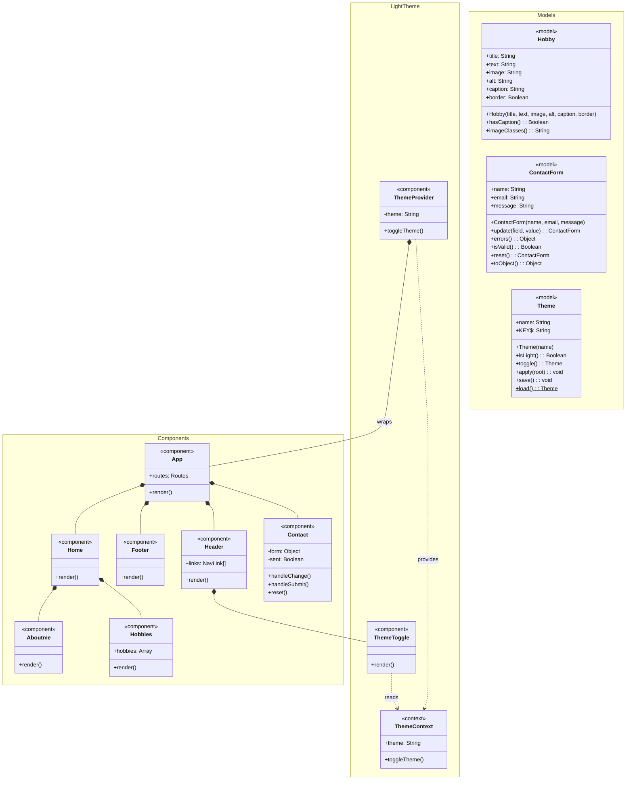

# Class Diagram: My React Website

Class diagram of the whole website: the React components, the light theme feature, and the model classes in `src/models`. It uses Mermaid, so it shows as a diagram on GitHub and in most Markdown viewers.

## Diagram

## Notation

| Symbol | Meaning |
|--------|---------|
| `+` | public member |
| `-` | private member (React state) |
| `$` | static member (belongs to the class) |
| `*--` | composition: the parent renders the child |
| `..>` | dependency: one class uses another |

## Classes

**Components** (`src/`)

- `App`: root layout. Holds the routes and renders `Header`, `Footer`, `Home` and `Contact`.
- `Header`: site title and navigation. Contains `ThemeToggle`.
- `Footer`: copyright line.
- `Home`: the home page. Renders `Aboutme` and `Hobbies`.
- `Aboutme`: the About Me section with the photo.
- `Hobbies`: the list of hobbies with images and captions.
- `Contact`: the contact form. Keeps the form values and a "sent" flag.

**Light theme** (`src/`)

- `ThemeProvider`: holds the current theme (dark by default), saves it in `localStorage`, and sets `data-theme` on the page.
- `ThemeContext`: shares the theme and `toggleTheme()` with the rest of the app.
- `ThemeToggle`: the Light/Dark button in the header.

**Models** (`src/models`)

- `Hobby`: one hobby entry (title, text, image, alt text, caption, border).
- `ContactForm`: the contact form data, with validation and reset.
- `Theme`: the light/dark theme, with toggle, apply, save and load.

The models are not imported by the components yet, so the diagram has no lines between them and the components.
