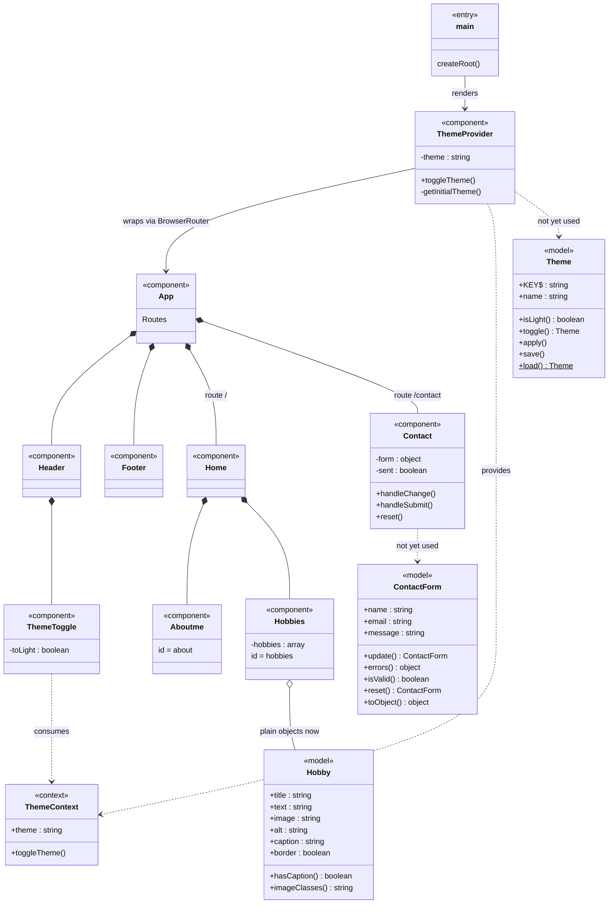

# Class Diagram: React Portfolio Website

## Notes

- **Component tree:** `main` renders `ThemeProvider`, which wraps `App`. `App` contains `Header`, `Footer`, `Home` (route `/`) and `Contact` (route `/contact`). `Home` contains `Aboutme` and `Hobbies`; `Header` contains `ThemeToggle`.
- **Theme flow:** `ThemeProvider` provides `ThemeContext`; `ThemeToggle` consumes it.
- **Model classes:** `Hobby`, `Theme` and `ContactForm` exist as plain JS classes but are not yet used by the components. `Hobbies.jsx` uses object literals, `ThemeProvider.jsx` duplicates the logic in `Theme`, and `Contact.jsx` keeps its own `useState` instead of using `ContactForm`.
